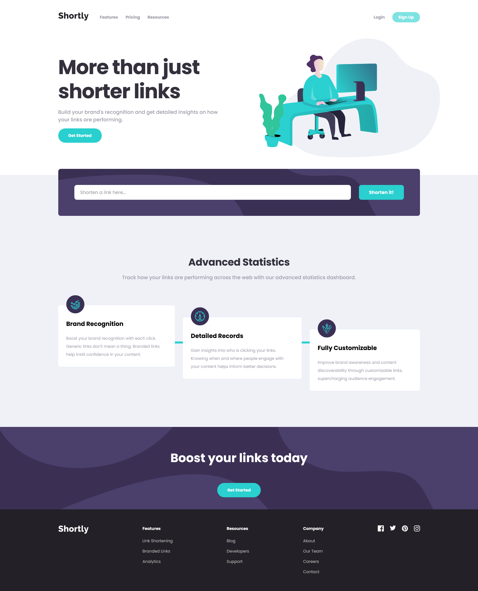

# Shortly URL shortening

[URL Shortener Live Site](https://url-shortener-page-noels-projects-e13071d7.vercel.app/)

## Overview

Users should be able to:

-   View the optimal layout for the site depending on their device's screen size
-   Shorten any valid URL
-   See a list of their shortened links, even after refreshing the browser
-   Copy the shortened link to their clipboard in a single click
-   Receive an error message when the `form` is submitted if:
    -   The `input` field is empty

### Built with

-   [Astro](https://astro.build/)
-   [React](https://reactjs.org/)
-   HTML/CSS

### Screenshot

This is a solution to the [Shortly URL shortening API Challenge challenge on Frontend Mentor](https://www.frontendmentor.io/challenges/url-shortening-api-landing-page-2ce3ob-G).
